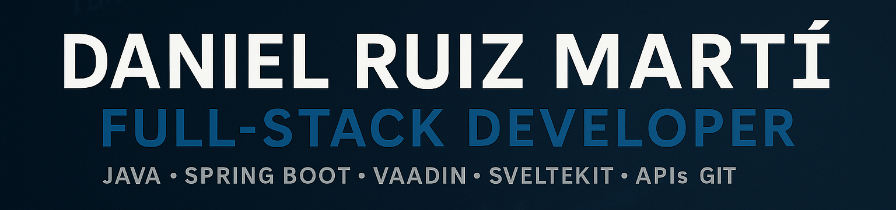

<!-- Encabezado animado (se simula con GIF o SVG externo) -->

  

---

## 👋 ¡Hola, soy Dani!

Soy desarrollador web en formación, especializado en backend moderno. Disfruto creando soluciones funcionales, seguras y bien estructuradas, tanto en entornos empresariales como freelance.  
Actualmente en búsqueda activa de empleo o prácticas relacionadas con el desarrollo web y la inteligencia artificial aplicada.

---

## 🚀 Stack principal

| Área            | Tecnologías principales                                                                 |
|-----------------|------------------------------------------------------------------------------------------|
| **Backend**     | PHP, Laravel · Java, Spring Boot · API REST · SvelteKit 5                                |
| **Frontend**    | HTML · CSS · JavaScript · Angular · Vaadin · Tailwind CSS                                |
| **Bases de datos** | SQL · MySQL · MariaDB · Liquibase · JPA · UML                                           |
| **Herramientas**| Git (Fork) · IntelliJ IDEA · Eclipse · Postman · XPath/XQuery                            |

---

## 💼 Proyectos destacados

### 🧩 Prácticas en Prismatech (Bélgica)
- Desarrollo real en un ERP empresarial llamado **eCust**.
- Tecnologías: Vaadin Flow, Spring Boot, Liquibase, MariaDB.
- Integración avanzada con **Google Drive API** mediante OAuth 2.0.
- Gestión de versiones con Git (Fork), uso de Nexus como repositorio.

### 🏭 TFG – App de gestión de inventario e incidencias
- Desarrollo completo de una aplicación de gestión industrial (**Next Gen Manager**).
- Funcionalidades: gestión de stock, pedidos, usuarios, proveedores y productos.
- Frontend con **SvelteKit 5** y **Tailwind CSS**.
- Backend con Drizzle ORM y base de datos relacional.
- En fase de mejora con integración de **IA para automatizar tareas comunes**.

---

## 🧠 Actualmente aprendiendo

- React y ecosistema moderno (hooks, context, router)
- IA local con FastAPI y spaCy

---

## 🌍 Idiomas

| Idioma   | Nivel |
|----------|-------|
| Español  | Nativo |
| Inglés   | B2 (EOI) |
| Francés  | B2 (DELF - Alliance Française) |

---

## 🧠 Habilidades blandas

- 💡 Pensamiento creativo
- 🔍 Atención al detalle y sentido visual
- 💬 Buena comunicación y escucha activa
- 🚀 Iniciativa y capacidad de aprendizaje rápido

---

## 🔗 Conecta conmigo

📧 danielruizmarti752@gmail.com

---

*Gracias por visitar mi perfil 🙌 ¡Estoy siempre abierto a nuevos proyectos y colaboraciones!*
